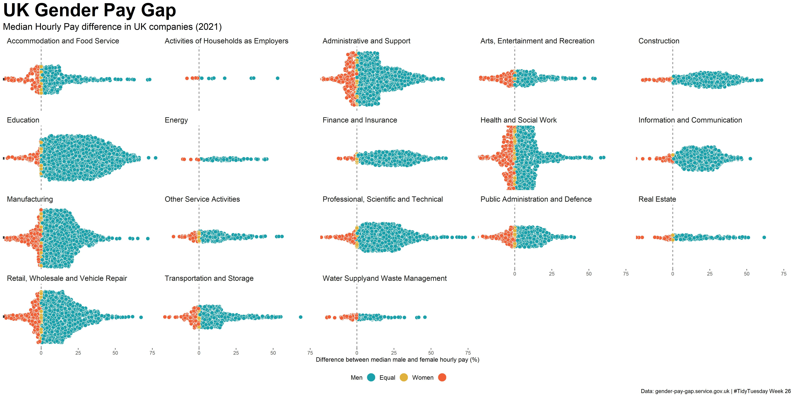
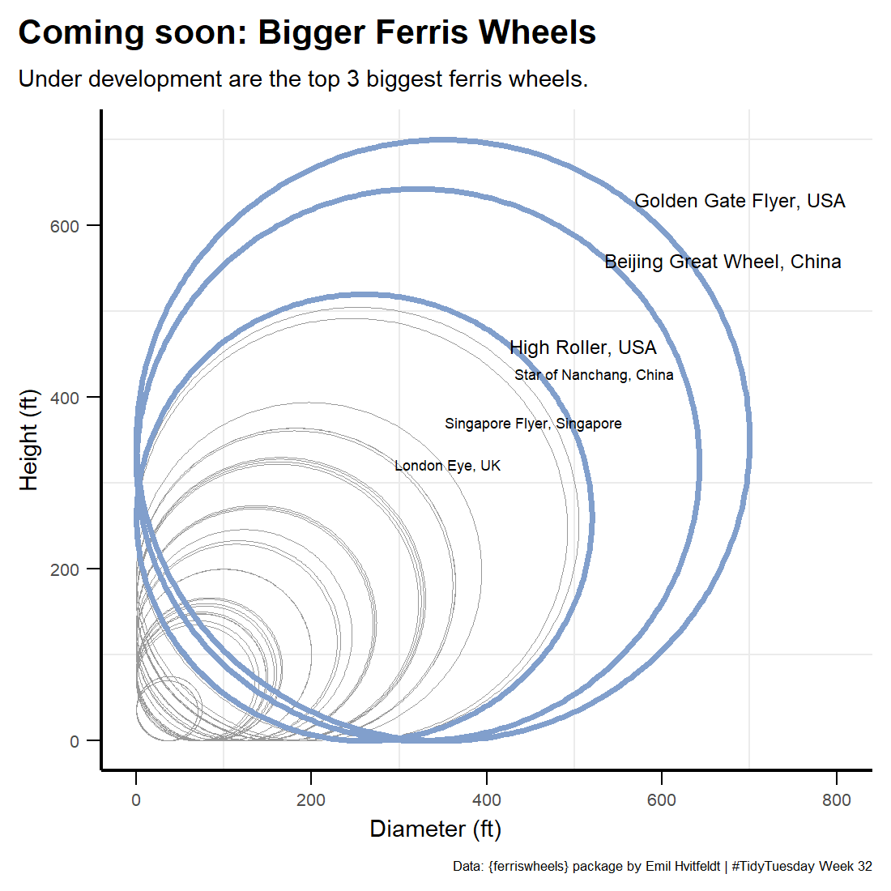
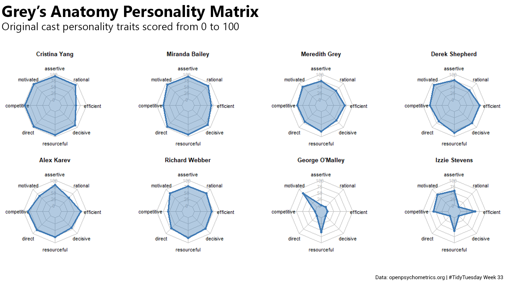
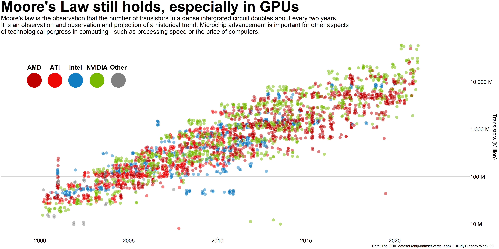
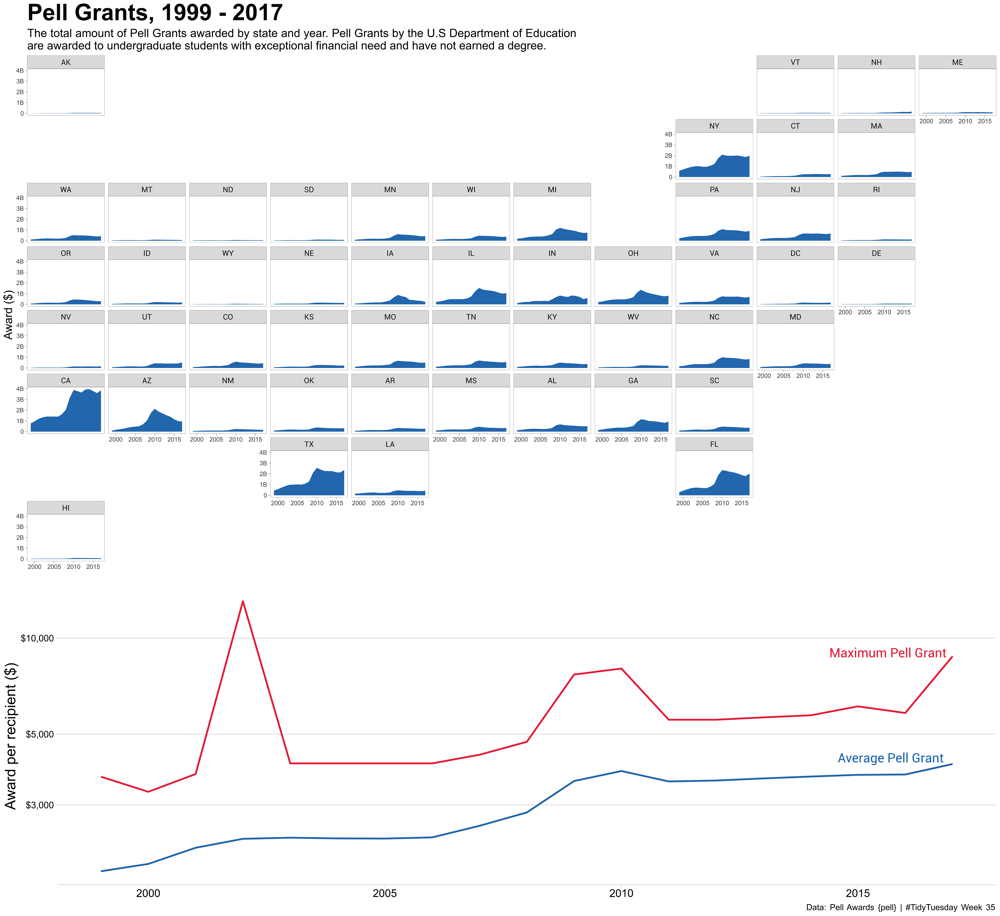

# My Entries for #TidyTuesday
[TidyTuesday](https://github.com/rfordatascience/tidytuesday/tree/master) is a weekly data project aimed at the R community, where participants work with real-world datasets. Below are my contributions to TidyTuesday challenges over the years.

## 2024

### [Week 22 - Lisa's Vegetable Garden {gardenR}](./2024/Week%2022/)

### [Week 27 - TidyTuesday's Data Variables and Observations {ttmeta}](./2024/Week%2027/)

### [Week 28 - Top R Functions Used by David Robinson {funspotr}](./2024/Week%2028/)

---

## 2022

### [Week 24 - US Drought](./2022/Week24/)

### [Week 25 - Slave Trade](./2022/Week25/)

### [Week 26 - UK Gender Pay Gap](./2022/Week26/)

### [Week 32 - Ferris Wheels {ferriswheels}](./2022/Week32/)

### [Week 33 - Psychometrics](./2022/Week33/)

### [Week 34 - Chips](./2022/Week34/)

### [Week 35 - Pell Grants](./2022/Week35/)
